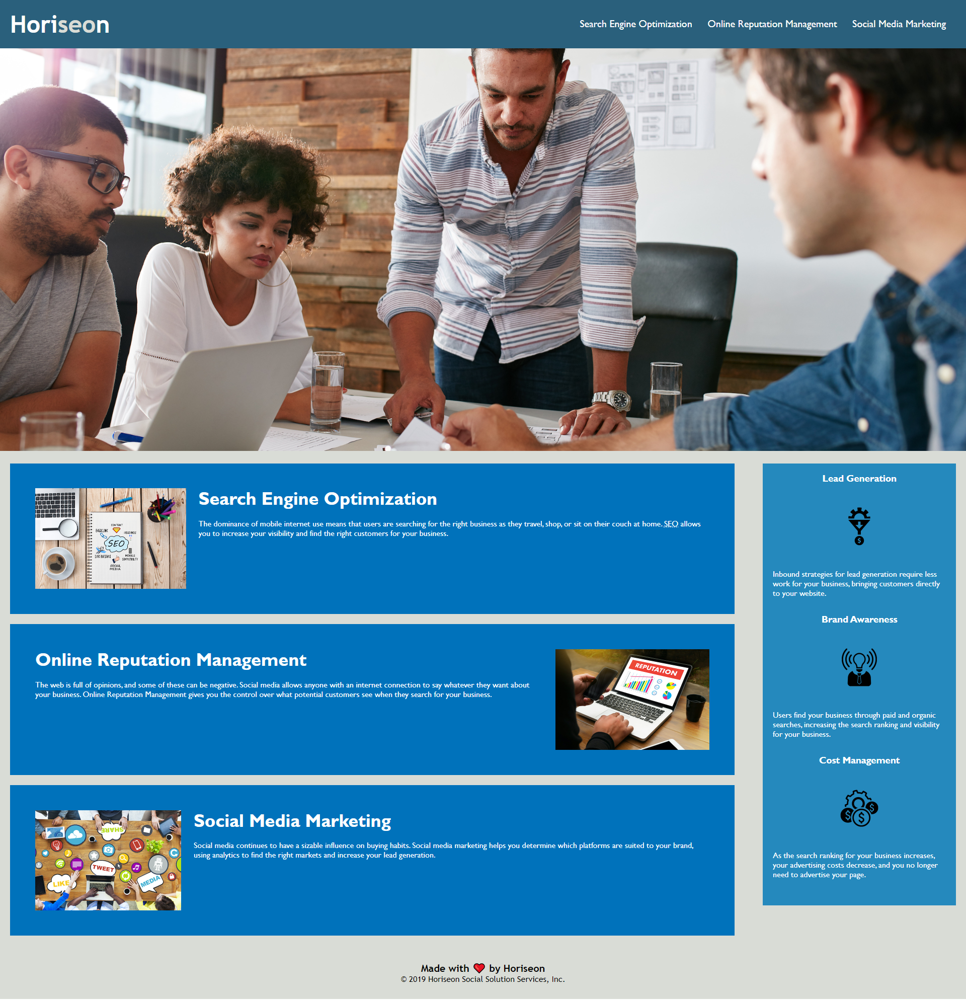

# Horiseon SE Refactor

## Table of Contents
- [Description](#description)
- [Visuals](#visuals)
- [Resources](#resources)

## Description

This is our first assignment. We changed some elements from

div to other things such as nav and article. We also edited

the css to clean it up and take out unnecessary parts

## Usage

The usage of this is to improve my grade and also get 

experience in cleaning up a website that is already created; 

One that I did not create on my own.

## Visuals

## Resources

[Live Site](https://nicklthompson.github.io/seo-refactor/)

[Repository](https://github.com/NickLThompson/seo-refactor)