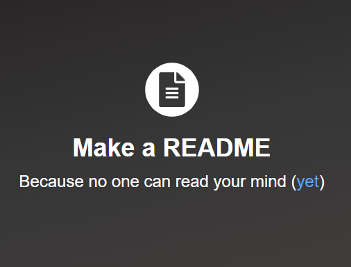

# Title

[LIVE SITE](https://www.google.com)

## Table of Contents
1. [Description](#description)
2. [Usage](#usage)
3. [Visuals](#visuals)

## Description

Here's a nice description

Here's additional description

## Usage

## Visuals


```html
this is a code block
```